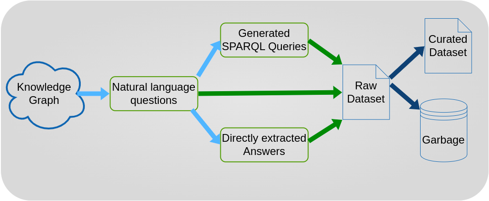

# LLMDatasetGenerator

This tool takes a knowledge graph in ttl format as input and generates KGQA datasets from that.
It does so by using multiple LLMs (see below) to generate appropriate questions for that specific knowledge graph, including the expected answers for reference and corresponding SPARQL queries.

This work was done for research purposes because by the time of this writing, there was no way to automatically generate datasets for training/finetuning from arbitrary knowledge graphs.

We hope to open up new areas of research by providing this prototype and are looking forward to contributions.

## Chosen models

Right now, there are two lists of models to choose from (feel free to customize): `small_models` and `medium_models`. 
The first one contains models with less than ten billion parameters plus Microsoft's `Phi-3-Medium`.
The second one contains model with up to 34 billion parameters as this was the physical limit that our hardware could handle.

## TODO

- Find GPU clusters that support models with more than 34B params
- Include more models, create a curated list of well performing models
- Use the output of the pipeline for fine tuning of a much smaller model and evaluate
- Add a method to handle really large knowledge graphs (e.g. subsampling and splitting into multiple chunks that fit the context size)
- Add a GUI for model selection and progress monitoring (low priority)

